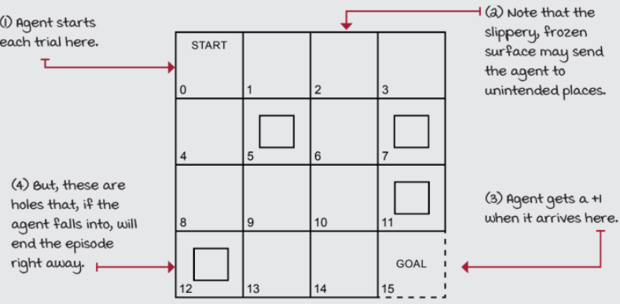

# VALUE ITERATION ALGORITHM

```
Name : Paarkavy B
Reg No : 212221230072
```

## AIM:
To develop a Python program to find the optimal policy for the given MDP using the value iteration algorithm.

## PROBLEM STATEMENT:
The FrozenLake environment in OpenAI Gym is a gridworld problem that challenges reinforcement learning agents to navigate a slippery terrain to reach a goal state while avoiding hazards. Note that the environment is closed with a fence, so the agent cannot leave the gridworld.

### STATES:
- **5 Terminal States**:
  - `G` (Goal): The state the agent aims to reach.
  - `H` (Hole): A hazardous state that the agent must avoid at all costs.
- **11 Non-terminal States**:
  - `S` (Starting state): The initial position of the agent.
  - Intermediate states: Grid cells forming a layout that the agent must traverse.

### ACTIONS:
The agent can take 4 actions in each state:
- `LEFT`
- `RIGHT`
- `UP`
- `DOWN`

### TRANSITION PROBABILITIES:
The environment is stochastic, meaning that the outcome of an action is not always certain.
- **33.33%** chance of moving in the intended direction.
- **66.66%** chance of moving in a orthogonal directions.

### REWARDS:
* +1 for reaching the goal state(G).
* 0 reward for all other states, including the starting state (S) and intermediate states.

### EPISODE TERMINATION:
The episode terminates when the agent reaches the goal state (G) or falls into a hole (H).

## GRAPHICAL REPRESENTATION:


## VALUE ITERATION ALGORITHM:
* Value iteration is a method of computing an optimal MDP policy and its value.
* It begins with an initial guess for the value function, and iteratively updates it towards the optimal value function, according to the Bellman optimality equation.
* The algorithm is guaranteed to converge to the optimal value function, and in the process of doing so, also converges to the optimal policy.

The algorithm is as follows:
1. Initialize the value function V(s) arbitrarily for all states s.
2. Repeat until convergence:
   - Initialize aaction-value function Q(s, a) arbitrarily for all states s and actions a.
   - For all the states s and all the action a of every state:
     - Update the action-value function Q(s, a) using the Bellman equation.
     - Take the value function V(s) to be the maximum of Q(s, a) over all actions a.
     - Check if the maximum difference between Old V and new V is less than theta.
     - Where theta is a small positive number that determines the accuracy of estimation.
3. If the maximum difference between Old V and new V is greater than theta, then 
    - Update the value function V with the maximum action-value from Q.
    - Go to step 2.
4. The optimal policy can be constructed by taking the argmax of the action-value function Q(s, a) over all actions a.
5. Return the optimal policy and the optimal value function.

## VALUE ITERATION FUNCTION:
```
import gym
desc=['SFFF','FHFF','HFFF','FGFF']
env = gym.make('FrozenLake-v1',desc=desc)
init_state = env.reset()
goal_state = 13
P = env.env.P


def value_iteration(P, gamma=1.0, theta=1e-10):
    V = np.zeros(len(P), dtype=np.float64)
    while True:
      Q=np.zeros((len(P),len(P[0])),dtype=np.float64)
      for s in range(len(P)):
        for a in range(len(P[s])):
          for prob,next_state,reward,done in P[s][a]:
            Q[s][a]+=prob*(reward+gamma*V[next_state]*(not done))
      if(np.max(np.abs(V-np.max(Q,axis=1))))<theta:
        break
      V=np.max(Q,axis=1)
    pi=lambda s:{s:a for s , a in enumerate(np.argmax(Q,axis=1))}[s]
    return V, pi
```

## OUTPUT:


## RESULT:
Thus, a Python program is developed to find the optimal policy for the given MDP using the value iteration algorithm.


